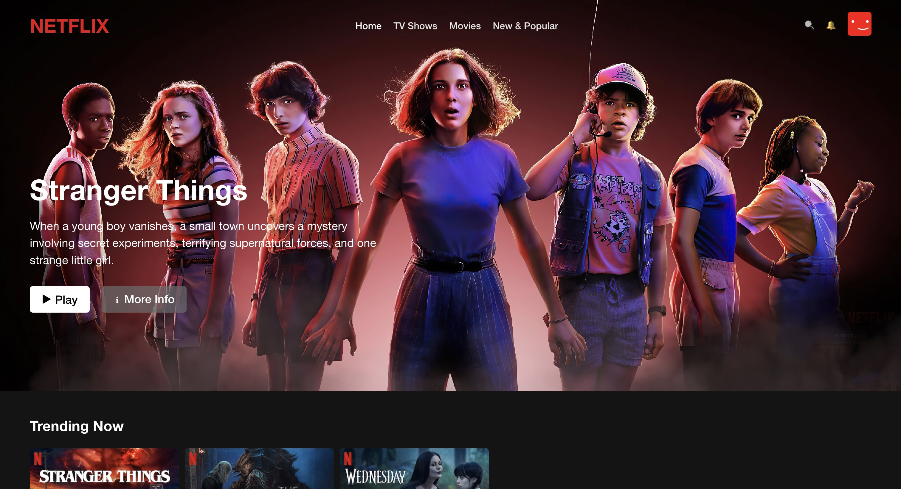

# Netflix Clone - Styling Practice Project

## Overview
This project is a React-based Netflix clone created as an exercise in front-end styling. The goal was to practice advanced CSS techniques and create an interactive, visually appealing web application inspired by Netflix's interface.

## Features
- Profile selection screen with hover effects
- Responsive movie browsing interface
- Dynamic header background on scroll
- Consistent movie poster layout

## Setup and Installation
1. Clone the repository
2. Run `npm install`
3. Start the development server with `npm run dev`
